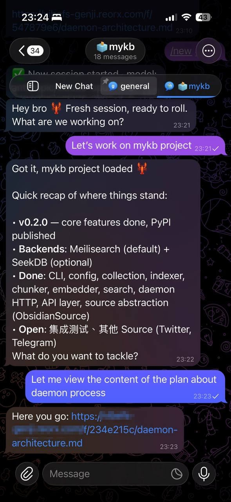
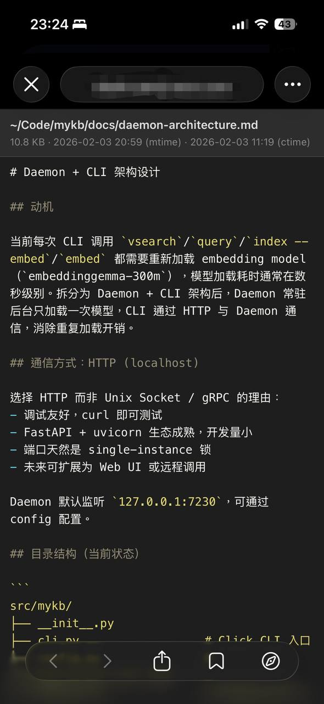

# vibefs

A file preview server with time-limited access control, designed for AI agents to share local files with users via URLs.

Files are not accessible by default. Each file must be explicitly authorized with a TTL (default: 1 hour). The server starts automatically on the first `allow` call and shuts down when all authorizations expire.

| Agent interaction | File preview |
|:---:|:---:|
|  |  |

## Install

With [uv](https://docs.astral.sh/uv/):

```bash
# Install globally
uv tool install vibefs

# Or run directly without installing
uvx vibefs --help
```

## Usage

### Authorize a file

```bash
vibefs allow /path/to/file.py
# http://localhost:17173/f/a3b7c2d1/file.py

vibefs allow /path/to/file.py --ttl 300   # 5 minutes
vibefs allow /path/to/file.py --head 50   # Only first 50 lines
vibefs allow /path/to/file.py --tail 20   # Only last 20 lines
```

The daemon starts automatically if it's not already running.

### Manage authorizations

```bash
vibefs list                 # List active authorizations
vibefs revoke <token>       # Revoke a specific authorization
```

### Server control

```bash
vibefs status               # Check if daemon is running
vibefs stop                 # Stop the daemon
vibefs serve                # Start server in foreground (for debugging)
```

### Configuration

```bash
vibefs config set base_url https://files.example.com
vibefs config get base_url
```

When `base_url` is set, the `allow` command outputs URLs using it instead of `localhost:port`:

```bash
vibefs allow /path/to/file.py
# https://files.example.com/f/a3b7c2d1/file.py
```

## File rendering

- Code and text files (`.py`, `.js`, `.md`, `.json`, etc.) are rendered with syntax highlighting via Pygments.
- Other files are served with their original content type.

## Deploy

vibefs listens on `localhost:17173` by default. To make it accessible from the internet, use a tunneling service to map the local port to a public domain.

### Cloudflare Tunnel

```bash
# Install cloudflared: https://developers.cloudflare.com/cloudflare-one/connections/connect-networks/downloads/

# Quick tunnel (temporary public URL)
cloudflared tunnel --url http://localhost:17173

# Named tunnel (persistent domain)
cloudflared tunnel create vibefs
cloudflared tunnel route dns vibefs vibefs.example.com
cloudflared tunnel run --url http://localhost:17173 vibefs
```

### Other options

- **ngrok**: `ngrok http 17173`
- **Tailscale Funnel**: `tailscale funnel 17173`
- **frp**, **bore**, or any TCP tunneling tool

After setting up the tunnel, configure the base URL so generated links use your public domain:

```bash
vibefs config set base_url https://vibefs.example.com
```

## Agent integration

To let an AI agent use vibefs, add instructions like the following to its system prompt or tool documentation:

```
You have access to `vibefs`, a file preview tool. When you want to share a file
with the user, run:

    vibefs allow /path/to/file [--ttl SECONDS]

This prints a URL. Send the URL to the user — they can open it in a browser to
view the file. The link expires after the TTL (default: 1 hour).

Use this when:
- Showing code, logs, or config files
- Sharing generated output
- Any time a file is easier to read in a browser than in chat
```

## State

All runtime data is stored in `~/.vibefs/`:

- `vibefs.db` — authorization records (SQLite)
- `vibefs.pid` — daemon PID file
- `vibefs.log` — daemon log output
- `config.json` — configuration

## License

MIT
